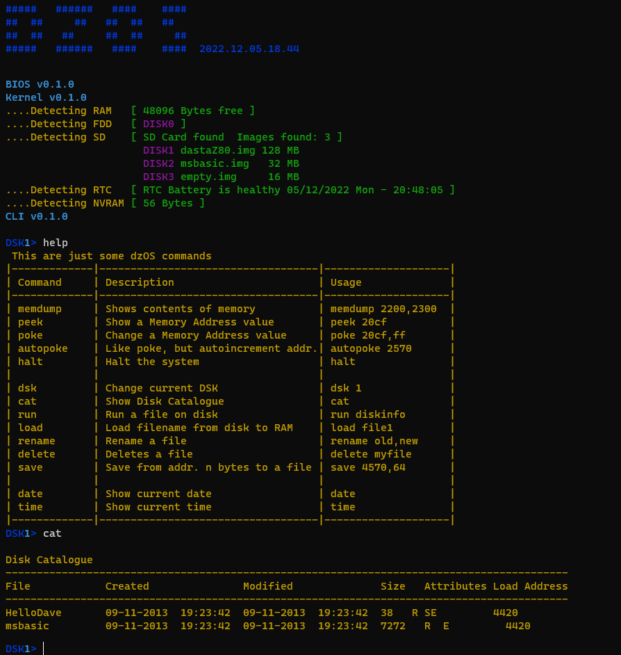
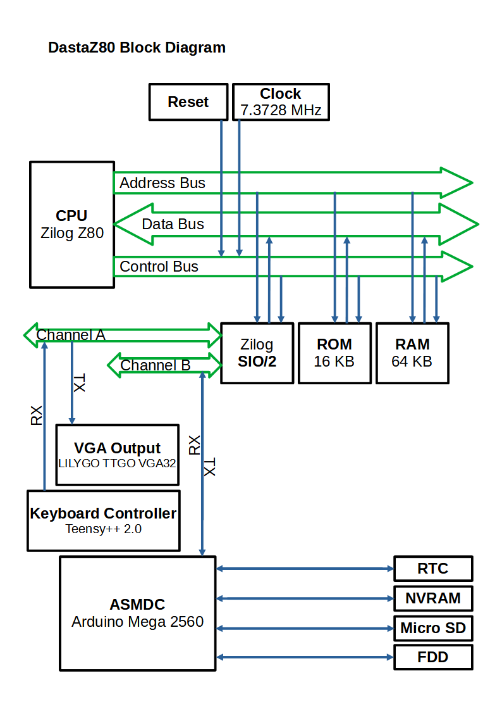

# dzos

1. [Project Status](#project-status)
    * [Hardware](#project-status)
      * [Mark I](#mark-i) (obsolete)
      * [Mark II](#mark-ii) (obsolete)
      * [Mark III](#mark-iii) (current)
      * [Block Diagram](#block-diagram)
    * [Software](#software)
    * [TODOs](#todos)
    * [Known BUGS](#known-bugs)
1. [Manuals and Guides](#manuals-and-guides)
1. [User Modifiable Operating System (Paged ROM and Jumpblocks)](#user-modifiable-operating-system-paged-rom-and-jumpblocks)
1. [Dual video output (VGA & Composite)](#dual-video-output-vga--composite)
1. [dzOS available commands](#dzos-available-commands)
    * [General commands](#general-commands)
    * [Disk commands](#disk-commands)
    * [Memory commands](#memory-commands)
    * [Real-Time Clock (RTC) commands](#real-time-clock-rtc-commands)
1. [How to use the SD Card module](#how-to-use-the-sd-card-module)
1. [Versioning System](#versioning-system)

---

**dzOS** is a single-user single-task ROM-based operating system (OS) for my 8-bit homebrew computer **dastaZ80**, which runs on a Zilog Z80 processor.

It is influenced by ideas and paradigms coming from Digital Research’s CP/M, but also from 8-bit computers of the 80s era. So some concepts may sound familiar to those who had the privilege of using those systems.

The OS consists of three parts:

* The **BIOS**, that provides functions for controlling the hardware.
* The **Kernel**, that provides general functions for everything that is not hardware dependent.
* The **Command-Line Interface (CLI)**, that provides commands for the user to talk to the Kernel and BIOS.

---

## Project Status

I've decided to divide the project into progressive models (or **Mark**, as I call it).

* **Current model: [Mark III](#mark-iii)**

### Mark I

* **CPU**: Z80 @ 7.3728 Mhz
* **ROM**: 16 KB with DZOS ([User Modifiable Operating System](#user-modifiable-operating-system-paged-rom-and-jumpblocks))
* **RAM**: 64 KB (~48 KB free). Lower 16 KB used by DZOS. Then approx. 1 KB for Stack, variables and Buffers. Free RAM starts at address 0x4420
* **Video output**: 80 columns by 25 rows 16 Colour ANSI Terminal, via [LILYGO TTGO VGA32 V1.4](https://www.lilygo.cc/products/fabgl-vga32) connected to the TX signal of the SIO/2 Channel A
* **Keyboard**: Acorn Archimedes A3010 keyboard connected to the RX signal of the SIO/2 Channel A
  * Implemented:
    * Alphabetic: A to Z
    * Number: 1 to 0
    * Symbols: `~!@#$%^&*()-_=+[{]}\|;:'",<.>/?
    * Shift key modifier: for capital alphanumeric letters and symbols
    * CapsLock key modifier
    * LEDs: Power, CapsLock, ScrollLock, NumLock, Disk activity
    * Keypad: 1 to 0, /*#-+. and Enter
    * Special keys
      * ScrollLock key: allows keyboard to be used as USB keyboard when ScrollLock LED is ON
      * Break: clears the screen
  * Not implemented (not needed):
    * Function keys: F1 to F12
    * Pound key
    * Control keys: Esc, Tab, Ctrl, Alt, Backspace
    * Special keys: Print, Insert, Home, Delete, etc.
    * Multiple modifier keys (e.g. Ctrl + Shift + key, Alt + Shift + key)
* **Power Supply**: 12V External Power Supply with 5V/2.5A Regulator
* **Arduino Serial Multi-Device Controller ([ASMDC](https://github.com/dasta400/ASMDC))**: An Arduino board acting as a _man-in-the-middle_ to allow dastaZ80 to communicate with different devices:
  * **Micro SD Card**: FAT32 formatted, with disk image files formatted with my own design file system (DZFS). Multiple disk image files can be configured in a file called __disks.cfg_ that MUST be on the SD card too.
  * **Real-Time Clock (RTC)**: Keeps date and time. Power is maintained via a rechargeable battery LIR2032.
  * **NVRAM**: 56 bytes.
  * **FDD**: Support for 3.5" High Density disks.
* **Case**: Acorn Archimedes A3010 all-in-one computer case
  * Connectors:
    * VGA (DE-15 female)
    * Power Supply (2.1mm Barrel Power Jack)
  * Others:
    * Micro SD Card slot
    * 3.5" Floppy Disk Drive (original Acorn A3010 FDD)
    * Power Switch ON/OFF
    * Reset button (tactile switch)

### Mark II

Same as [Mark I](#mark-i), adding:

* **Power Supply**: 5V/4A External Power Supply. Removed the 12V to 5V DC-DC converter.
* **Video output**: Added NTSC Composite 15 Colours video output, via TMS9918A VDP. dastaZ80 has now become a [Dual video output (VGA & Composite) system](#dual-video-output-vga--composite).
* **Sound output**: Added AY-3-8912 (Programmable Sound Generator)
* **Case**:
  * Connectors:
    * Added 3.5mm jack to 3 RCA Audio/Video cable (same cable used on the Raspberry Pi for Composite output), with NTSC Composite from TMS9918A and stereo audio from AY-3-8912.
    * USB Type Mini-B female, for using keyboard as external keyboard of computers with USB.

### Mark III

Same as [Mark II](#mark-ii), adding:

* **Real-Time Clock (RTC)**: the RTC has been removed from the [ASMDC](https://github.com/dasta400/ASMDC) and it has now its own board, with a TI bq4845 RTC and a 3V battery button cell.
  * NVRAM is not available anymore.
* **Cartridge Port**: allows to almost instantaneously load and access programs from a ROM cartridge plugged into the port. The port exposes only the memory-related signals (A0..A15, D0..D7, /MEMRD) from the CPU, power supply (+5V, GND), the ROM select signal (/ROM_CE) from the Control Bus, and a special signal (EXTROM) to indicate that a cartridge is inserted and the internal ROM shouldn't be used.
  * The Cartridge Connector is a 30 pins (2×15) Standard Card Edge Connector 2.54 mm pitch, located at the back of the computer case.
  * ROM Cartridges have an edge connector with 15 contacts on each side of the PCB, spaced to 2.54mm, that connects to the Cartridge Connector.
  * When a ROM Cartridge is inserted the internal ROM should be disabled, so that the computer executes code from the ROM cartridge instead of the OS. To enable this feature, the EXTROM signal is connected to +5V.
* **Auto load&run files from disk**: When the user types a command, if the command entered is not a DZOS command, CLI checks in the current disk if a file with the name of the command exists. If it does and has attribute _EXE_, it loads it into RAM and executes it. No need anymore for _run \<filename>_. Simply type the filename to execute it.
* **Two different case models**:
  * **dastaZ80 Original** in Acorn Archimedes A3010 all-in-one computer case.
  * **dastaZ80DB (Desktop Box)** in a box. User I/O (screen, keyboard) is done via serial communication with a terminal software (e.g. minicom, PuTTY).
* **External Serial HDD**: Instead of the [ASMDC](https://github.com/dasta400/ASMDC) with MicroSD Card, a FTDI-to-USB cable can be used to connect the dastaZ80 to a PC and use the [Serial HDD Simulator](https://github.com/dasta400/dzSoftware/tree/main/DiskTools) program, which is 3.8 times faster than the ASMDC, to access disk images stored in the PC.

### Block Diagram

### Software

* Keyboard Controller Arduino code for Teensy++ 2.0 ([folder src/A3010KBD](https://github.com/dasta400/dzOS/tree/master/src/A3010KBD))
* [FabGL Library](http://www.fabglib.org/) Arduino code for VGA32 ([folder src/VGA32](https://github.com/dasta400/dzOS/tree/master/src/VGA32))
* **OS**:
  * **BIOS** & **Kernel**:
    * Communicates with the different hardware modules (memory, keyboard controller, video interfaces, sound generator, joysticks, [ASMDC](https://github.com/dasta400/ASMDC)).
  * **Command Line Interface (CLI)**:
    * Shows prompt.
    * Reads input from keyboard and calls subroutines to the corresponding commands entered by the user.
    * Displays information back to the user.
  * **DZFS** (dastaZ80 File System) **This file system is still in experimental phase. Lost of data may occur due to unknown bugs or changes in specifications.**
* **Programs and Tools**: My [dzSoftware repo](https://github.com/dasta400/dzSoftware) contains software that I'm developing for dzOS.

### TODOs

* ✔ ~~Do not allow renaming System or Read Only files.~~
* ✔ ~~Do not allow deleting System or Read Only files.~~
* ✔ ~~Disable disk commands if at boot the CF card was detected as not formatted.~~
* ✔ ~~Make "_Attributes_" and "_Load Address_", of command _cat_, to print in the same column.~~
* ✔ ~~When _load_ or _run_, if the file has the attribute _E_, ignore the load address stored in BAT and instead load at the address specified in the binary.~~
* Add support for 3.5" Double Density disks.

### Known BUGS

* _save_ command fails to create the corresponding BAT entry when there are already 15 files.
* ✔ ~~_run_, _rename_, _delete_ and _chgaatr_, are not taking in consideration the full filename (e.g. _disk_ is acting on file _diskinfo_)~~
* ✔ ~~Keyboard controller is sending character for each press of special keys (e.g. Shift)~~
* F_KRN_DZFS_GET_BAT_FREE_ENTRY not finished (doesn't check of deleted files if no available entries found).
* ✔ ~~Message "_....Detecting RTC  [ RTC Battery needs replacement ] ....Detecting NVRAM  [ 56 Bytes ]_" lacks CarriageReturn~~
* ✔ ~~Results of _cat_ command are longer than 80 columns.~~
* ✔ ~~There are some artifacts on the Composite Video screen, due to some bad data in the VDP's Colour Table.~~
* ✔ ~~Files on disk can be run directly by simply entering the filename as a CLI command, but CLI is not checking if the file is an EXE or not.~~

---

## Manuals and Guides

* [User’s Manual](https://github.com/dasta400/dzOS/blob/master/docs/user_manual/dastaZ80%20Manual%20-%20User%E2%80%99s%20Manual.pdf)
* [Programmer’s Reference Guide](https://github.com/dasta400/dzOS/blob/master/docs/programmer_guide/dastaZ80%20Manual%20-%20Programmer%E2%80%99s%20Reference%20Guide.pdf)
* [Technical Reference Manual](https://github.com/dasta400/dzOS/blob/master/docs/techref_manual/dastaZ80%20Manual%20-%20Technical%20Reference%20Manual.pdf)

---

## User Modifiable Operating System (Paged ROM and Jumpblocks)

At boot, the contents of the ROM (containing DZOS) are copied to High RAM (starting at address 0x8000), then the ROM chip is disabled (paged out) and the contents of DZOS (now at 0x8000) are copied to Low RAM (starting at 0x0000). Then DZOS is started, running only from RAM.

As the OS is running entirely from RAM, it can be modified by the user. But changing subroutines that fit exactly in the same number of bytes, so that others are not overwritten, would be very difficult. And that's where _Jumpblocks_ come in handy.

All DZOS subroutines are called via _Jumpblocks_. These jumpblocks are simple _JP_ (jump) instructions to where the subroutine code is located in memory. By changing the two bytes (address) of a jump instruction, a subroutine can be redirected to a different one.

All jumpblock addresses can be found in the _dzOS.exp_ file in the _exp_ folder. Or in the documentation.

For example, imagine we're testing a new (hopefully better) subroutine for division of two 16-bit numbers. Looking at the file _dzOS.exp_, we find that _F_KRN_DIV1616_ is located at 0x3F79. If we look at the contents of the three bytes starting at that address (e.g. with command _peek_), we will find _C3 01 1A_. This means that whenever a program calls _F_KRN_DIV1616_, it does a jump (opcode C3) to address 0x1A01 (stored as little-endian), which is where the subroutine code starts.

Now we want that the jump is done to our new code instead. First we put the assembled code of our new subroutine somewhere in RAM (e.g. 0x5000). Next we change the jump by changing the address bytes with _poke 3F7A,00_ and _poke 3F7B,50_. The opcode _C3_ (jump) MUST not be changed.

From now on and until next reboot, whenever a program (and even DZOS itself), calls _F_KRN_DIV1616_, it will be jumping to our new subroutine at 0x5000

Jumpblocks also allow me to change the subroutines in DZOS without altering the address that is seen by the calling subroutines, thus keeping retrocompatibility with previous versions of the operating system.

---

## Dual video output (VGA & Composite)

The computer has two independent simultaneous video outputs:

* **VGA output**: 80 columns by 25 rows 16 Colours ANSI Terminal.
* **Composite output**: 256×192 pixels (32 columns by 24 rows) NTSC Composite 16 Colours (Graphics II Mode) video output.

The operating system and supplied programs are mainly outputting data to the VGA output, and I call this the _High Resolution Display_. Having 80 columns for text is more adecuate for applications.

The composite output, called the _Low Resolution Display_, will be used for games and graphics from applications. Being limited to 40 columns, it's not ideal for text, so I limited it also to only Graphics II mode. At least for the moment, until I experiment a bit more with it.

---

## dzOS available commands

For more detailed information, check the [dastaZ80 User's Manual](https://github.com/dasta400/dzOS/blob/master/docs/dastaZ80%20(Mark%20I)%20Manual%20-%20User%E2%80%99s%20Manual.pdf).

### General commands

* **run _[address]_**: moves the CPU Program Counter (PC) to the specified RAM address, so that the CPU starts executing whatever code finds in there.
* **halt**: halts the system. Tells [ASMDC](https://github.com/dasta400/ASMDC) to close the image files, and puts the computer in the state of HALT.

### Disk commands

* **cat**: shows disk (Floppy or SD Card Disk Image File) catalogue (i.e. the contents of the disk).
* **load _[filename]_**: loads specified filename from disk to RAM.
* ~~**run _[filename]_**: loads specified filename from disk to RAM and starts running it.~~ Files can now be run by simply typing the filename as if it was an OS command.
* **formatdsk _[label]_**: formats a Floppy Disk or a Disk Image File with DZFS (my own design file system).
* **rename _[old_filename]_,_[new_filename]_**: changes the name of file old_filename to new_filename.
* **delete _[filename]_**: deletes filename. Data isn't deleted, just the first character of the filename in the BAT is set to 7E (~), so it can be undeleted. Be aware, that it's planned that in future versions the _save_ command will search for an empty entry in the BAT, but if it finds none, then it will re-use the first entry of a deleted file. Therefore, undelete of a file will only be guaranteed if no file was created since the delete command was issued.
* **chgattr _[filename]_,_[new_attributes(RHSE)]_**: changes the attributes of filename to the new specified attributes (R=Read Only, H=Hidden from _cat_ command, S=System, E=Executable).
* **save _[address_start]_,_[number_bytes]_**: creates a new file on the disk, that will contain _n_ number of bytes, starting at the specified address. After entering the command, the user will be prompted to type the filename.
* **dsk _[disk unit]_**: changes the current disk to the number specified. 0 is always the FDD and then 1 to 15 are the Disk Image Files on the SD Card.
* **diskinfo**: shows label, serial number, date and time of formatting of current disk.
* **disklist**: shows a list of all Disk Image Files and their disk unit number.

### Memory commands

* **peek _[address]_**: shows the byte stored at _address_.
* **poke _[address]_,_[value]_**: overwrittes the byte stored at _address_ of RAM, with _value_.

### Real-Time Clock (RTC) commands

* **date**: shows the current date.
* **time**: shows the current time.
* **setdate _[ddmmyyyy]_**: changes the date stored in the RTC.
* **settime _[hhmmss]_**: changes the time stored in the RTC.

---

## How to create Disk Images FIles

We will need:

* Linux Terminal
* If using the [Arduino Serial Multi-Device Controller (ASMDC)](https://github.com/dasta400/ASMDC):
  * A Micro SD Card formatted with FAT32 file system
  * ASMDC connected to SIO/2 Channel B at 115,200 8N1
* If not, disk image files copied to a folder in a PC running the [Serial HDD Simulator](https://github.com/dasta400/dzSoftware/tree/main/DiskTools)

Follow the steps:

1. Open a Linux Terminal
1. Create a 1 MB file: _fallocate -l $((1 * 1024 * 1024)) myimage.img_
   * Disk Images Files can be of a maximum of 33 MB. Change the first number from 1 to the desired value.
   * Image file names (e.g. _myimage.img_) MUST be [8.3 filename](https://en.wikipedia.org/wiki/8.3_filename) format.
1. Create more image files if needed, up to a maximum of 16 in total
1. Copy the _.img_ file(s) into the Micro SD Card (if using [ASMDC](https://github.com/dasta400/ASMDC))
1. Create a text ASCII file called __disks.cfg_ and add one line for each _.img_ file, with its name in the line. Be sure to leave an extra line at the end of the file. _#_ can be used to write comments.

Alternatively:

* image files can be created (already formatted with DZFS) with _imgmngr_ (tool provided with [ASMDC](https://github.com/dasta400/ASMDC)): _imgmngr -new myimage.img mydisk_
* an image file can be generated and include in it a list of programs with _makeimgfile_ (tool provided with [ASMDC](https://github.com/dasta400/ASMDC))

---

## Versioning System

### Releases

A release of DZOS contains all three parts (referred as _Components_), and is named as _dzOS.yyyy.mm.dd.hh.mm.bin_, where:

* **_yyyy_** is the **year** the released binary was created.
* **_mm_**  is the **month** the released binary was created.
* **_dd_** is the **day** the released binary was created.
* **_hh_** is the **hour** the released binary was created.
* **_mm_** is the **minutes** the released binary was created.

### Components

Components are the **BIOS**, the **Kernel** and the **Command-Line Interface (CLI)**. These components are versioned as _component_name v_ and then _maj.min.patch_ (e.g. Kernel v0.1.0), where:

* **_maj_** indicates a **major change** in functionality. Some features may be incompatible with previous major version.
* **_min_** indicates adding of **new features** to a major version.
* **_patch_** indicates **bug solving** of current functionality/features.

During initial development, until I decide that DZOS is stable enough to be used, all components will have v0.1.0. After that, I will release v1.0.0 and then the _maj.min.patch_ will start applying.
